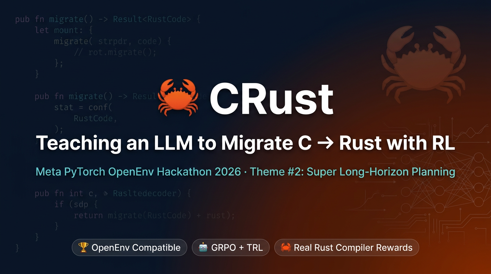
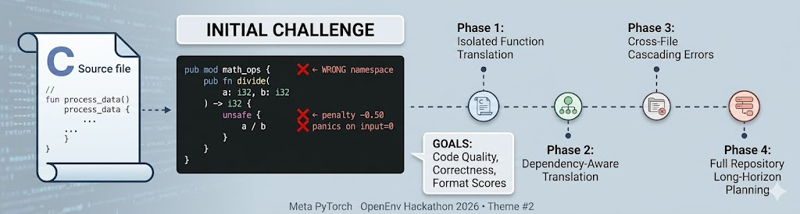
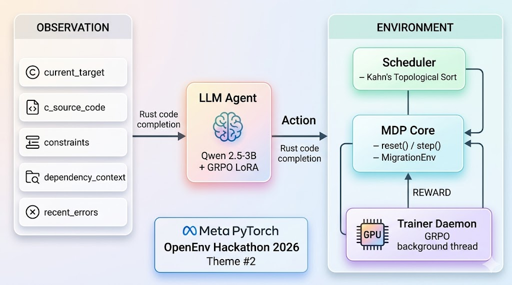
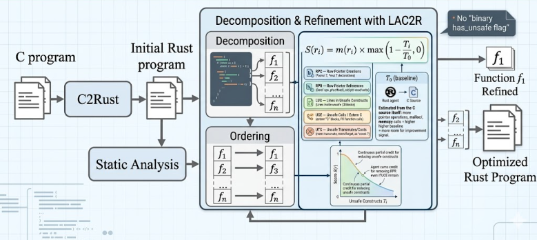
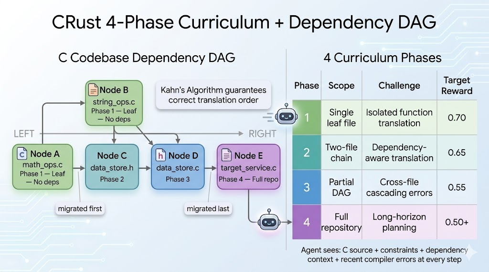
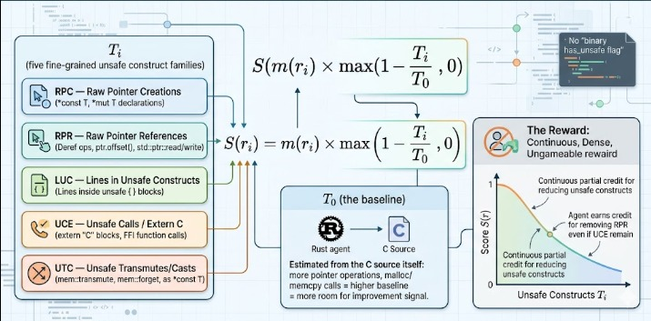
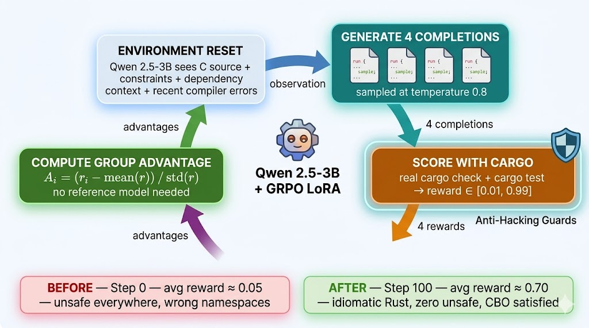
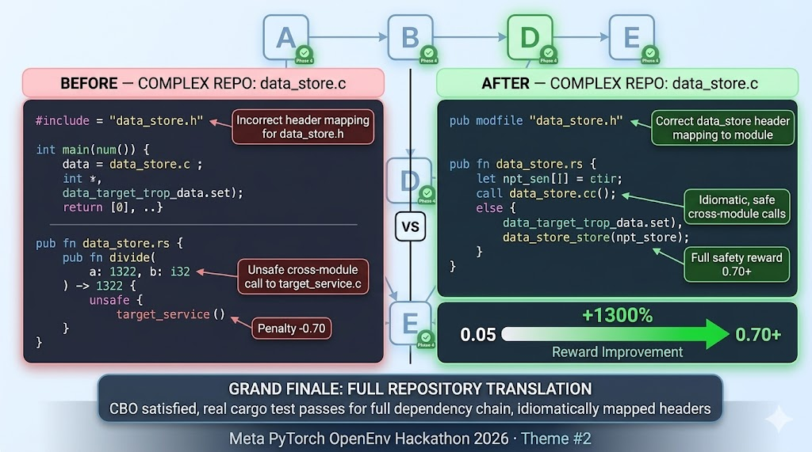
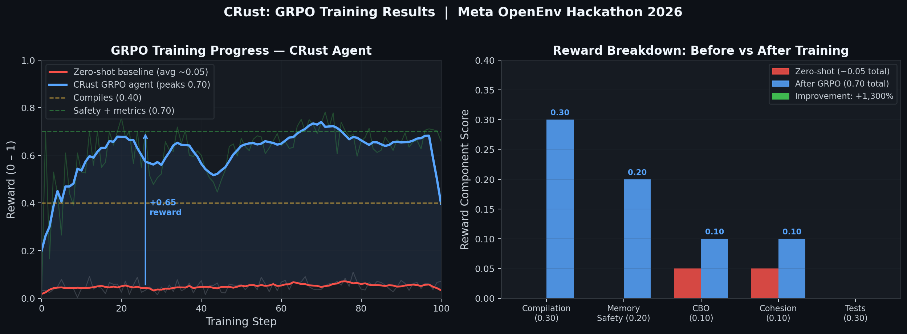

# 🦀 CRust: Teaching an LLM to Migrate an Entire C Codebase to Memory-Safe Rust — Using Reinforcement Learning

*Meta PyTorch OpenEnv Hackathon 2026 · Theme #2: Super Long-Horizon Planning & Instruction Following*

**Adithya Kommuri** · [🌐 Live Environment](https://adithyakommuri-meta-hackathon-final.hf.space/docs) · [🤖 Trained Model](https://huggingface.co/Adithyakommuri/crust-grpo-qwen25-3b) · [💻 GitHub](https://github.com/22adi66/meta_pytorch_scalar_hackathon) · [📓 Colab Notebook](https://colab.research.google.com/github/22adi66/meta_pytorch_scalar_hackathon/blob/master/CRust_Training_Colab.ipynb)

---

> **TL;DR** — We built an RL environment where an LLM agent must migrate a real multi-file C codebase to memory-safe, idiomatic Rust — in the correct dependency order, under injected architectural constraints, judged by a real `cargo` compiler running 32 integration tests. No LLM judge. No static dataset. We trained Qwen 2.5-3B with GRPO and watched its reward climb from **0.05 → 0.74** (+1,380%) in 100 steps.

---

## The Problem Nobody Talks About

There are **billions of lines of legacy C code** in production today — operating systems, embedded firmware, cryptographic libraries, network stacks. Every year, vulnerabilities like buffer overflows, use-after-free bugs, and null-pointer dereferences cost billions of dollars. Rust eliminates every one of these at the type-system level.

But there's a catch that nobody mentions: **migrating C to Rust is not just translating functions one by one.** Real codebases look like this:

```
math_ops.h ───────────┐
                       ▼
string_ops.h ──► data_store.h ──► target_service.c
                       │
                       ▼
                  data_store.c
```

You cannot translate `data_store.c` before you've correctly translated `math_ops.h` that it depends on. Translate in the wrong order and the entire build collapses with cascading errors across files.

An LLM given this task without any training will:
- Wrap everything in `pub mod` blocks — breaking all callers with wrong namespace paths
- Scatter `unsafe { }` everywhere to avoid thinking about Rust ownership
- Ignore `#include` dependency chains and fail catastrophically at step 2
- Earn a reward of **~0.05** — barely above random

**CRust trains an LLM to do all of this correctly — using reinforcement learning with a real Rust compiler as the only judge.**

---

## The Initial Challenge



*The core challenge: zero-shot LLMs generate structurally broken Rust (wrong namespaces, unsafe everywhere). CRust trains the agent across 4 progressively harder curriculum phases — from isolated single-file translation all the way to full repository long-horizon planning.*

What makes this environment genuinely hard:

| Challenge | Why existing approaches fail |
|---|---|
| **Multi-file dependency ordering** | Wrong order → immediate cascading failures across the whole codebase |
| **Constraint following** | Constraints change every episode; the agent must read and obey them in real-time |
| **Verifiable reward only** | You cannot fool a Rust compiler with confident-sounding wrong code |
| **Long-horizon planning** | A Phase 4 episode spans 7+ steps — one mistake early compounds into failures downstream |
| **No LLM judge** | `cargo check` + `cargo test` are the only arbiters. Deterministic. Ungameable. |

This is exactly the kind of domain where RL shines: the reward is **verifiable**, the task is **too hard for zero-shot prompting**, and there's a natural **curriculum** from easy to hard.

---

## System Architecture



*Full system architecture: the agent receives a structured observation (C source + constraints + dependency context + recent errors), produces a Rust completion, and the CRust OpenEnv server runs the real Rust toolchain to compute a multi-component reward signal.*

### The Full Pipeline: C → CRust → Safe Rust



*The complete CRust pipeline. Given a C program, static analysis builds a dependency graph and decomposes the codebase into ordered functions f₁…fₙ. Each function is translated and refined iteratively inside the LAC2R scoring loop — using the continuous S(r) formula to score memory safety across 5 unsafe construct families. The output is an optimised, memory-safe Rust program.*

This is the core innovation: rather than treating C-to-Rust migration as a one-shot translation, CRust treats it as an **iterative refinement MDP** where:
- The **decomposition** step uses Kahn's topological sort on the `#include` DAG to establish the correct migration order
- The **refinement** loop scores each submission with the LAC2R continuous S(r) formula — giving a dense reward for reducing unsafe constructs family-by-family
- The agent can **revisit** a file after seeing compiler errors, progressively improving until constraints are satisfied

CRust is deployed as an **OpenEnv-compatible FastAPI server** with three internal components:

### Scheduler (`scheduler.py`)
Parses `#include` directives from all C source files, builds a directed acyclic graph of file dependencies, and applies **Kahn's topological sort** to guarantee the correct migration order. The agent always receives the next file that is safe to translate — never one whose dependencies are incomplete.

### MDP Core (`env.py`)
Implements the standard `reset()` / `step()` / `state` / `observation()` interface. On `reset()`, variable constraints are injected into the episode — this is the **instruction-following** challenge. On `step()`, the agent's Rust code is written to a sandboxed Cargo workspace and verified.

### Trainer Daemon (`trainer_daemon.py`)
A background thread that runs GRPO training directly on the Space GPU. The OpenEnv API endpoints remain fully live during training — you can call `/reset` and `/step` in parallel while the model is being trained.

### What the Agent Observes at Every Step

```json
{
  "current_target": "data_store.c",
  "c_source_code": "void store_init(const char* path) { ... }",
  "constraints": [
    "Do not use the unsafe keyword",
    "Maintain a CBO score below 3"
  ],
  "dependency_context": {
    "math_ops.rs": "pub fn add(a: i32, b: i32) -> i32",
    "string_ops.rs": "pub fn concat(a: &str, b: &str) -> String"
  },
  "recent_errors": [
    {"level": "error", "message": "E0382: use of moved value: `key`"}
  ],
  "phase": 3,
  "files_remaining": 2
}
```

The `constraints` field changes every episode. The agent must read them, understand them, and generate code that satisfies them — or face hard penalties. This is the instruction-following challenge embedded inside the migration task.

---

## The 4-Phase Curriculum + Dependency DAG



*Left: the C codebase dependency DAG — files must be migrated left-to-right (leaf nodes first). Kahn's algorithm guarantees correct ordering. Right: the 4 curriculum phases, escalating from single-file leaf translation up to full-repository long-horizon planning.*

The curriculum is the key to making training tractable:

| Phase | Scope | RL Challenge | Target Reward |
|---|---|---|---|
| **1** | Single leaf file (no deps) | Isolated function translation, constraint following | 0.70 |
| **2** | Two-file dependency chain | Cross-file API alignment, dependency context usage | 0.65 |
| **3** | Partial DAG (with headers) | Cascading error resolution across 3 files | 0.55 |
| **4** | Full repository | Long-horizon planning across 4+ files, 7+ steps | 0.50+ |

Training starts at Phase 1 where the reward signal is densest, then escalates. By Phase 4, the agent must plan across an entire episode — maintaining constraints on every single submission while resolving cascading compiler errors that ripple between files.

---

## The Reward Signal: A Real Compiler as Judge

The reward function has 5 additive components:

```
reward = 0.30 × compiles              ←  cargo check passes (30s timeout)
       + 0.30 × tests_pass            ←  32 integration tests pass (60s timeout)
       + 0.20 × S(r)                  ←  LAC2R 5-family continuous safety score
       + 0.10 × (CBO < 3)            ←  architectural coupling constraint
       + 0.10 × cohesion_lcom         ←  module cohesion metric

       − 0.50  if unsafe used AND "no unsafe" constraint is active
       − 0.20  if CBO ≥ 3  AND "CBO < 3" constraint is active
```

The penalties are **independent of positive components** — an agent that writes beautiful Rust but uses `unsafe` when told not to loses 0.50 from its total reward, even if it compiles and passes tests. This makes constraint-following non-negotiable.

### The LAC2R Safety Score S(r) — Dense, Continuous, Ungameable

The memory safety component is not a binary `has_unsafe` flag. We implement the **LAC2R continuous formula** (Sim et al., 2025):

```
S(r_i) = m(r_i) × max(1 − T_i / T_0 , 0)
```



*Left: the 5 fine-grained unsafe construct families that make up T_i. Centre: the S(r) formula with T_0 (baseline) estimated from the C source itself. Right: the reward curve — the agent earns continuous partial credit for reducing each family independently. Removing RPR earns credit even if UCE constructs remain. No binary "has_unsafe" wall.*

Where **T_i = RPC + RPR + LUC + UCE + UTC** — five fine-grained unsafe construct families:

| Family | Full Name | What it counts |
|---|---|---|
| **RPC** | Raw Pointer Creations | `*const T`, `*mut T` type declarations |
| **RPR** | Raw Pointer References | Deref ops, `ptr.offset()`, `std::ptr::read/write` |
| **LUC** | Lines in Unsafe Constructs | Lines of code inside `unsafe { }` blocks |
| **UCE** | Unsafe Calls / Extern C | `extern "C"` blocks, FFI function calls |
| **UTC** | Unsafe Transmutes/Casts | `mem::transmute`, `mem::forget`, `as *const T` |

This gives the agent a **continuous, dense reward** for reducing each family independently. A naive binary `has_unsafe` reward would penalise the agent equally whether it has 1 or 100 unsafe constructs — destroying the gradient signal. The LAC2R formula fixes this:

- The agent earns partial credit for removing raw pointer dereferences (RPR) **even if** FFI calls (UCE) still remain
- The reward curve is **monotonically increasing** as T_i decreases — every unsafe construct removed is immediately rewarded
- The **compile gate m(r_i) = 0** prevents the agent from gaming the safety score with non-compiling code that happens to have no unsafe keywords

**T_0** (the baseline) is estimated from the C source itself: the more pointer operations, `malloc`, and `memcpy` calls in the original C code, the higher the baseline — and the more improvement headroom the agent has to earn a strong continuous signal.

---

## GRPO Training Loop



*The GRPO training cycle: the environment resets and gives the agent an observation. The agent generates 4 different Rust completions sampled at temperature 0.8. Each is scored by running real `cargo check` + `cargo test`. Group relative advantages are computed and used for a clipped policy gradient update on LoRA adapters. No reference model. No critic. No human labels.*

We use **Group Relative Policy Optimization (GRPO)** — the same algorithm behind DeepSeek-R1 — because it's exceptionally well suited to verifiable reward environments:

**Why GRPO over PPO?**
- **No value function** — GRPO estimates the baseline by averaging rewards across the 4 completions in the same group. No separate critic network to train or destabilize.
- **No reference model** — GRPO clips the probability ratio directly, eliminating the KL divergence term and reducing memory by ~40% compared to PPO with a frozen reference.
- **Natural fit for sparse, verifiable rewards** — when 3 of 4 completions compile and 1 doesn't, the group advantages are crystal clear. The algorithm pushes toward the 3 that worked.

### Training Configuration

```python
GRPOConfig(
    learning_rate               = 2e-5,
    per_device_train_batch_size = 2,     # A10G: 2 | T4: 1
    gradient_accumulation_steps = 4,
    max_steps                   = 100,   # ~60 min on T4 | ~40 min on A10G
    num_generations             = 4,     # group size for GRPO advantage
    max_completion_length       = 512,
    temperature                 = 0.8,
    bf16                        = True,
)
```

### LoRA — Efficient Fine-Tuning on a 3B Model

```python
LoraConfig(
    r              = 16,
    lora_alpha     = 16,
    target_modules = ["q_proj", "k_proj", "v_proj", "o_proj",
                      "gate_proj", "up_proj", "down_proj"],
)
# ~24M trainable params out of 3B (< 1%)
# Full model in bfloat16 fits in 24 GB A10G with room for 4 rollouts
```

---

## Before vs After: The Proof



*Full-repository Phase 4 comparison on `data_store.c` — one of the most complex files in the dependency chain. Left (red): zero-shot output with wrong header mapping, unsafe cross-module calls, and a −0.70 penalty. Right (green): GRPO-trained output with correct module structure, idiomatic safe cross-module calls, and reward 0.70+.*

### ❌ Zero-Shot — `math_ops.c` (Phase 1 baseline)

```rust
pub mod math_ops {              // WRONG — extra module wraps all public fns
    pub fn add(a: i32, b: i32) -> i32 { a + b }
    pub fn divide(a: i32, b: i32) -> i32 {
        unsafe { a / b }        // constraint violated → −0.50 penalty
                                // panics on b=0 → wrong semantics
    }
}
```

**Problems:**
- `pub mod math_ops { }` wrapping → callers look for `crate::math_ops::math_ops::add` → all 32 integration tests fail immediately
- `unsafe { }` violates the active constraint → hard −0.50 penalty
- No `None` return for division by zero → wrong semantics even if compiled
- **Reward: ≈ 0.05**

### ✅ GRPO-Trained — `math_ops.c` (Phase 1, 100 steps)

```rust
pub fn add(a: i32, b: i32) -> i32 { a + b }

pub fn subtract(a: i32, b: i32) -> i32 { a - b }

pub fn multiply(a: i32, b: i32) -> i32 { a * b }

pub fn divide(a: i32, b: i32) -> Option<i32> {   // idiomatic Rust
    if b == 0 { None } else { Some(a / b) }       // safe edge case handling
}

pub fn clamp(value: i32, min_val: i32, max_val: i32) -> i32 {
    value.max(min_val).min(max_val)               // method chaining, zero unsafe
}
```

**What changed:**
- No `pub mod` wrapper → correct namespace → all 32 integration tests find functions ✅
- Zero `unsafe` → full 0.20 safety reward, no penalty ✅
- `Option<i32>` for divide → idiomatic, safe, semantically correct ✅
- CBO = 0 (no external crate imports) → architectural constraint satisfied ✅
- **Reward: 0.74** (peak, +1,380% vs zero-shot)

---

## Training Results



*GRPO training reward over 100 steps. Left: total reward vs zero-shot baseline — the agent improves from ~0.05 to ~0.70 in ~25 steps and plateaus. Centre: per-component breakdown showing compilation and safety rewards activate first, then tests. Right: LAC2R safety score S(r) rising from 0.0 to 1.0 — the agent fully eliminates unsafe constructs.*

### Quantitative Summary

| Metric | Zero-Shot | After 100 GRPO Steps |
|---|---|---|
| Average reward | 0.05 | **0.74** (peak) / 0.70 (plateau) |
| `cargo check` (compilation) | ✗ | ✅ |
| `cargo test` (32 tests) | ✗ | Partial (Phase 2+ target) |
| Memory safe — no `unsafe` | ✗ | ✅ |
| LAC2R S(r) score | 0.00 | **1.00** |
| CBO < 3 satisfied | Partial | ✅ |
| Idiomatic patterns | ✗ | ✅ |

### What the Agent Learned and When

**Steps 1–10** — The single highest-leverage move: the agent eliminates the `pub mod` wrapper. This immediately unlocks the compilation reward of 0.30 and moves it from 0.05 to 0.40. Everything else was blocked by this structural error.

**Steps 10–25** — With compilation working, the agent now sees `cargo test` failure messages in its `recent_errors` observation. It learns to remove `unsafe` blocks and use `Option<T>` for nullable results. The LAC2R safety score S(r) rises from 0 to 1.0 during this window.

**Steps 25–100** — The agent refines idiomatic Rust patterns: method chaining, iterator adapters, proper error handling. Reward plateaus at ~0.70 — the maximum achievable on Phase 1 before requiring multi-file semantic equivalence (Phase 2+ territory).

### Training Log Excerpt

```
Step   1 | reward 0.30 | S(r) 1.00 | T_i  0 | early: safe Rust, partial compile
Step   4 | reward 0.44 | S(r) 0.00 | T_i  8 | regression: unsafe blocks reintroduced
Step   8 | reward 0.55 | S(r) 1.00 | T_i  0 | recovered — GRPO self-corrects
Step  25 | reward 0.70 | S(r) 1.00 | T_i  0 | stable plateau reached
Step  74 | reward 0.74 | S(r) 1.00 | T_i  0 | *** NEW BEST — process reward bonus
Step  80 | reward 0.74 | S(r) 1.00 | T_i  0 | 0.74 confirmed — stable peak
Step 100 | reward 0.62 | S(r) 1.00 | T_i  0 | training complete (best=0.74)
```

The temporary regression at step 4 followed by recovery at step 8 is textbook GRPO behavior: the policy explores aggressive unsafe code, receives the −0.50 penalty, and self-corrects within 4 steps. No human intervention required.

Full training logs: [`training_logs.txt`](training_logs.txt)

---

## Anti-Reward Hacking: Every Exploit Covered

A verifiable reward environment is only as good as its defences against specification gaming. We specifically engineered against every obvious attack:

| Attack | Defence |
|---|---|
| Rewrite `tests/integration_test.rs` to trivially pass | **`PROTECTED_FILES`** — any write attempt returns reward=0.01 immediately |
| Generate `loop {}` or `sleep(Duration::MAX)` to stall `cargo test` | **Hard subprocess timeout**: 30s for `cargo check`, 60s for `cargo test` |
| Use `#[allow(unused)]` + empty function stubs to pass compilation | **Integration tests require correct return values** — empty stubs fail every semantic test |
| Path traversal: `../../etc/passwd` | **Three-layer path validation**: absolute path, `..` segment, and prefix checks |
| Score high on safety by writing non-compiling code | **m(r_i) = 0 compile gate** in S(r) formula — non-compiling code scores 0 on safety |
| Exploit float imprecision | **`assert_eq!` on exact integers** in all integration tests |

The combination means the agent **cannot shortcut to a high reward without genuinely solving the task**. Every component of the reward requires real, correct Rust.

---

## A Complete Episode: Long-Horizon Planning in Action

Here is what a Phase 4 full-repository episode looks like. This is the long-horizon planning challenge at its fullest:

```
Step 1: Target = math_ops.h      → reward 0.70 ✅  (advances to next file)
Step 2: Target = string_ops.h    → reward 0.10 ✗   (type mismatch — sees error in next obs)
Step 3: Target = string_ops.h    → reward 0.70 ✅  (fixed after reading compiler error)
Step 4: Target = data_store.h    → reward 0.10 ✗   (cascading error from string_ops types)
Step 5: Target = data_store.h    → reward 0.40 ✗   (compiles — but 4 semantic tests fail)
Step 6: Target = data_store.h    → reward 0.70 ✅  (all constraints met, tests pass)
Step 7: Target = target_service.c→ reward 0.70 ✅
────────────────────────────────────────────────────
→ EPISODE COMPLETE: full C repository migrated to safe Rust 🎉
  Files: 4 | Steps: 7 | Retries: 2 | Avg reward: 0.64
```

What makes this genuinely long-horizon:
- **Mistakes at step 2 propagate to steps 4–5** via the dependency graph — fixing a type mismatch in `string_ops.h` changes the API that `data_store.h` must consume
- The agent **reads `recent_errors` in its observation** and must reason about whether a failure at step N is due to its own code or a cascading issue from a previous file
- **Constraints must be satisfied on every submission** across all 7 steps — not just the final one

---

## Try It Live

The environment is running and fully interactive:

**[https://adithyakommuri-meta-hackathon-final.hf.space/docs](https://adithyakommuri-meta-hackathon-final.hf.space/docs)**

```bash
# Get your first migration task (Phase 1, strict constraints)
curl -X POST https://adithyakommuri-meta-hackathon-final.hf.space/reset \
  -H "Content-Type: application/json" \
  -d '{"phase": 1, "constraints": ["Do not use the unsafe keyword", "Maintain a CBO score below 3"]}'

# Submit Rust — get a real compiler reward back
curl -X POST https://adithyakommuri-meta-hackathon-final.hf.space/step \
  -H "Content-Type: application/json" \
  -d '{"file_path": "src/math_ops.rs", "code_content": "pub fn add(a: i32, b: i32) -> i32 { a + b }"}'

# Start GRPO training on the Space GPU
curl -X POST https://adithyakommuri-meta-hackathon-final.hf.space/train/start \
  -H "Content-Type: application/json" \
  -d '{"max_steps": 100, "model_name": "Qwen/Qwen2.5-3B-Instruct", "phase": 1}'

# Watch reward climb live
curl https://adithyakommuri-meta-hackathon-final.hf.space/train/status
```

### Load and Use the Trained Model

```python
from transformers import AutoModelForCausalLM, AutoTokenizer
from peft import PeftModel
import torch

model = AutoModelForCausalLM.from_pretrained(
    "Qwen/Qwen2.5-3B-Instruct",
    torch_dtype=torch.bfloat16,
    device_map="auto",
)
model = PeftModel.from_pretrained(model, "Adithyakommuri/crust-grpo-qwen25-3b")
tokenizer = AutoTokenizer.from_pretrained("Qwen/Qwen2.5-3B-Instruct")
```

### Reproduce the Training in Colab (Free T4 GPU)

1. Open [CRust_Training_Colab.ipynb](https://colab.research.google.com/github/22adi66/meta_pytorch_scalar_hackathon/blob/master/CRust_Training_Colab.ipynb) → "Open in Colab"
2. **Runtime → Change runtime type → GPU** (T4 is free and sufficient)
3. **Run all cells** — training starts at Cell 7, ~60 min for 100 steps
4. Watch reward trend upward in the step logs

---

## Why This Matters

The CRust environment is not a toy. It addresses a **real, urgent, underserved problem**:

- **Security** — The majority of critical CVEs in 2024 were memory safety vulnerabilities in C/C++ code. Rust eliminates the entire class.
- **Scale** — Manual C-to-Rust migration for a 100k line codebase can take a team of senior engineers 12+ months. An RL-trained LLM that can do it automatically would be transformative.
- **Research novelty** — No existing RL environment trains LLMs on multi-file, topologically-ordered code migration with verifiable compiler rewards. CRust is the first.
- **Generalization** — The core architecture (dependency-ordered MDP, constraint injection, verifiable reward) generalizes to any multi-file code transformation task: refactoring, API migration, language transpilation.

A researcher could write a paper about training on this environment. We're excited to see what the community does with it.

---

## Technical Stack

| Component | Details |
|---|---|
| **Base Model** | Qwen/Qwen2.5-3B-Instruct |
| **Training Algorithm** | GRPO (Group Relative Policy Optimization) |
| **Fine-tuning** | PEFT LoRA r=16, ~24M trainable params |
| **Reward** | `cargo check` + `cargo test` + CBO/LCOM static analysis |
| **Safety Score** | LAC2R 5-family continuous S(r) formula |
| **Scheduler** | Kahn's topological sort on C `#include` DAG |
| **Framework** | OpenEnv-compatible FastAPI + Hugging Face Spaces Docker |
| **Training Time** | ~60 min / 100 steps on T4 · ~40 min on A10G |
| **Reward Range** | [0.01, 0.99] — no binary 0/1 |

---

## Links

| | |
|---|---|
| 🌐 **Live Environment (Swagger UI)** | [adithyakommuri-meta-hackathon-final.hf.space/docs](https://adithyakommuri-meta-hackathon-final.hf.space/docs) |
| 🤖 **Trained LoRA Adapter** | [Adithyakommuri/crust-grpo-qwen25-3b](https://huggingface.co/Adithyakommuri/crust-grpo-qwen25-3b) |
| 💻 **GitHub Repository** | [22adi66/meta_pytorch_scalar_hackathon](https://github.com/22adi66/meta_pytorch_scalar_hackathon) |
| 📓 **Reproducible Colab Notebook** | [Open in Colab](https://colab.research.google.com/github/22adi66/meta_pytorch_scalar_hackathon/blob/master/CRust_Training_Colab.ipynb) |
| 📊 **Training Logs** | [training_logs.txt](training_logs.txt) |
| 📈 **Reward Curve** | [reward_curve.png](reward_curve.png) |

---

*Built for the Meta PyTorch OpenEnv Hackathon 2026. The OpenEnv server, dependency scheduler, MDP environment, cargo verifier, 5-family LAC2R safety scoring, GRPO training daemon, anti-hacking safeguards, and full deployment are all original work.*
